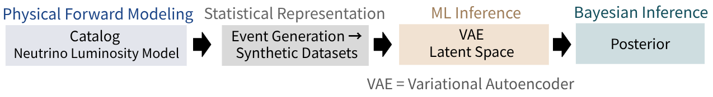
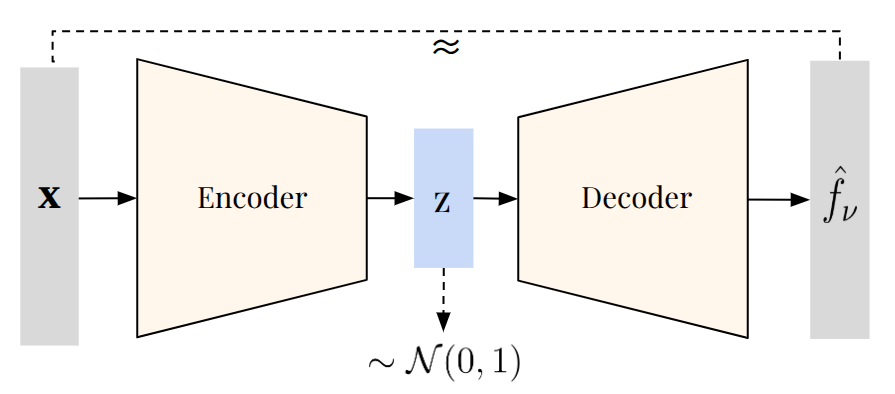

# Decoding the Sky: Machine Learning Approaches to Bayesian Modeling of Neutrino Source Populations 
## Population Modeling for AGN Neutrinos under Extreme Sparsity using a Variational Autoencoder (VAE)

## Scientific Motivation

High-energy neutrinos detected by IceCube might well originate from active galactic nuclei (AGN), yet we cannot infer individual AGN neutrino fluxes. We can, however, ask: "What kind of population could have produced what we see?". Essentially, we observe too few neutrinos to identify sources, but not too few to constrain populations. In this hierarchical modeling approach, AGN are viewed as a statistical ensemble and we have population-level parameters, which are thresholds/rules that determine which sources emit neutrinos, as well as source-level parameters which are unique properties of each source. To achieve this, we need to choose appropriate Luminosity Models and tackle Computational Challenges. Direct Bayesian Inference is impossible for high dimensional inputs. To do it properly, we need to integrate over thousands of dimensions, consider every possible AGN configuration and for each one, compute likelihoods. To solve for this, we learn a surrogate for the forward-model outputs (expected rates) to make likelihood evaluation fast.

## What kind of tool is needed?

-> AGN Population Modeling Framework:

  

In this framework, each module is validated independently on synthetic data. In essence, a previously intractable inference problem becomes computationally accessible (but not yet astrophysically complete).

## Physical Forward Modeling

In this step, one essentially defines a hypothetical universe using a 1) catalog of AGN combined with 2) Luminosity models.

### 1) Source Catalog listing AGN Properties 

The analysis uses the **SPIDERS** AGN catalog (SDSS-IV DR16) (`spiders_quasar_bhmass-DR16-v1.fits`), which provides per-source measurements of:

- Redshift $z$
- Bolometric luminosity $L_{\mathrm{bol}}$
- Black hole mass $\log M_{\mathrm{BH}}$
- Eddington ratio $\lambda_{\mathrm{Edd}} = L_{\mathrm{bol}} / L_{\mathrm{Edd}}$

A redshift-dependent column selection merges the low- $z$ and high- $z$ sub-samples into a single clean catalog of ~7000 AGN.

### 2) A Rule (Luminosity Model) mapping AGN -> Neutrino Emission

At the current stage of the analysis, two different Luminosity Models are utilized, a simple step model for a proof-of-principle and a more complex model to verify dimensionality reduction.

#### Step (Threshold) Model

The simplest Neutrino Luminosity model used for a proof-of-principle assumes that only AGN above certain thresholds in black hole mass and accretion rate produce neutrinos:

$$
L_{\nu}(\lambda_{\rm Edd}, \log M_{\rm BH},  L_{\rm bol}; \boldsymbol{\xi}) = 
\xi_{\mathrm{fix}} \cdot \theta(\lambda_{\mathrm{Edd}} - \xi_{1,i}) \cdot 
\theta(\log M_{\mathrm{BH}} - \xi_{2,i}) \cdot L_{\mathrm{bol}}
$$

$$
f_{\nu}(z,\lambda_{\rm Edd}, \log M_{\rm BH},  L_{\rm bol}; \boldsymbol{\xi}) = 
\frac{L_{\nu}(\lambda_{\rm Edd}, \log M_{\rm BH},  L_{\rm bol}; \boldsymbol{\xi})}{4\pi D_L(z)^2}
$$

The entire flux function can then be expressed as:

$$
f_{\nu}(z,\lambda_{\rm Edd}, \log M_{\rm BH},  L_{\rm bol}; \boldsymbol{\xi}) =
\xi_{\text{fix}} \cdot \theta\left(\lambda_{\mathrm{Edd}}-\xi_{1,i}\right) \cdot \theta\left(\log M_{\mathrm{BH}}-\xi_{2,i}\right) \cdot \frac{L_{\mathrm{bol}}}{4 \pi D_L(z)^2}
$$

where $f_{\nu}$ is the neutrino flux at the detector, $z$ is the redshift of the source, and $D_L(z)$ is the luminosity distance at redshift $z$, computed using the Planck18 cosmology. The step model is parameterized by three population-level parameters, out of which two will be learned by a neural network in the subsequent analysis steps. $\xi_{\mathrm{fix}}$ is a fixed normalization parameter that accounts for the overall neutrino production efficiency, detector efficiency, as well as observation time. $\xi_{1,i}$ is the threshold on the Eddington ratio $\lambda_{\mathrm{Edd}}$. This parameter is learned. Only sources with $\lambda_{\mathrm{Edd}} \geq \xi_{1,i}$ contribute to the neutrino luminosity. The second learned parameter is $\xi_{2,i}$, the threshold on the logarithm of the black hole mass $\log M_{\mathrm{BH}}$. Only sources with $\log M_{\mathrm{BH}} \geq \xi_{2,i}$ contribute to the neutrino luminosity.

#### Extended (Complex) Model

A more complex model, utilized to demonstrate dimension reduction (6D+ input -> 3D,2D Latent) adds redshift evolution, a luminosity power law, and configurable step-function signs:

$$
L_{\nu}(\lambda_{\mathrm{Edd}}, \log M_{\mathrm{BH}},  L_{\mathrm{bol}}; \boldsymbol{\xi}) = 
\xi_{\mathrm{fix}}\cdot  \theta(\text{sign}(\xi_5) (\lambda_{\mathrm{Edd}} - \xi_{1,i})) \cdot \theta(\text{sign}(\xi_6) (\log M_{\mathrm{BH}} - \xi_{2,i})) \cdot  (1+z)^{\xi_3} \cdot L_{\mathrm{bol}}^{\xi_4}
$$

and using the same relation as above to obtain  $f_{\nu}$:

$$
f_{\nu}(z,\lambda_{\mathrm{Edd}}, \log M_{\mathrm{BH}},  L_{\mathrm{bol}}; \boldsymbol{\xi}) = 
\xi_{\mathrm{fix}}\cdot  \theta(\text{sign}(\xi_5) (\lambda_{\mathrm{Edd}} - \xi_{1,i})) \cdot \theta(\text{sign}(\xi_6) (\log M_{\mathrm{BH}} - \xi_{2,i})) \cdot  (1+z)^{\xi_3} \cdot \frac{L_{\mathrm bol}^{\xi_4}}{4\pi D_L(z)^2}
$$

where $f_{\nu}$ is the neutrino flux at the detector, $z$ is the redshift of the source, $\lambda_{\mathrm{Edd}}$ is the Eddington ratio, $M_{\mathrm{BH}}$ is the black hole mass, $L_{\mathrm{bol}}$ is the bolometric luminosity, $D_L(z)$ is the luminosity distance at redshift $z$, computed using the Planck18 cosmology, $\theta(x)$ is the Heaviside step function and $\boldsymbol{\xi} = (\xi_{1,i}, \xi_{2,i}, \xi_3, \xi_4, \xi_5, \xi_6)$ is the vector of population-level parameters.

## Statistical Representation

### Event Generation

For a fixed AGN catalog and Luminosity Model, observed neutrino counts are realizations of a Poisson point process 

$$
n_i \sim \text{Poisson}(\lambda_{i})
$$

Effectively in the code, for each source i, the observed neutrino count is drawn from a Poisson distribution:

$$
n_i \sim \mathrm{Poisson}\bigl(10^{\mathrm{norm}} \cdot f_{\nu,i} + \mathrm{bg}\bigr)
$$

where `norm` controls the overall signal strength and `bg` is a uniform background rate.

where $\lambda_{i} = f_{\nu,i} + \mathrm{bg}$ comes from the forward model. $f_{\nu,i}$ are expected signal counts from the flux model. 

### Statistical Realizations

This process is repeated to create multiple synthetic datasets representing possible observed neutrino event distributions. The training loss in the ML part of this pipeline matches exactly this process. 

## Machine Learning Inference & Latent Space Analysis

ML in this framework enables tractable Bayesian Inference for Complex Luminosity Models with high input dimensionality. The network architecture utilized to achieve this is the Variational Autoencoder (VAE).

  

A VAE learns a compressed latent representation $\mathbf{z}$ of the population-level model parameters.

### Inputs to the Network

The encoder takes a batch of per-source vectors, where each source has its catalog features ( $z$, $L_{\mathrm{bol}}$, $\log M_{\mathrm{BH}}$, $\lambda_{\mathrm{Edd}}$ ) plus one extra feature that encodes the observed count (per-source log count). 

### Encoder

A per-source MLP processes each AGN's features, followed by a selection of sources with the highest neutrino count and an aggregation network that maps the full catalog to a latent distribution $q(\mathbf{z} \mid \mathbf{x}) = \mathcal{N}(\mu, \sigma^2)$.

- **Architecture Details**:
Per-source MLP (4 → 8 → 8 → 8 → 4) encodes each source independently → top-1000 selection by observed counts → flatten & reduce (5000 → 256 via Linear + ReLU) → BN + Dropout bridge → 8 pre-activated ResNet blocks (BN → ReLU → Linear → Dropout, dim 256, hidden 512) → Linear output to [μ, log σ²] (~ 8.8M params)

### Latent Representation

In the latent representation, the observed data is encoded into a low-dimensional latent vector $\mathbf{z}$

### Decoder (Surrogate Forward Model)

The decoder acts as a fast surrogate, takes a latent sample $\mathbf{z}$ and outputs the signal-only per-source mean  $\hat f_{\nu,i}$. Then, a The decoder is trained so that its output approximates the forward model $f_\nu$ for the parameters encoded in $\mathbf{z}$.

- **Architecture Details**:
Reparameterize z = μ + σε from 2D latent → simple expanding MLP (2 → 16 → 32 → 64 → 128 → 1500) with Dropout(0.2) + ReLU per layer → exp(·) - 1 for non-negative predicted rates (~ 205K params)

### Outputs of the Network

As mentioned before, the decoder outputs a non-negative per-source signal prediction $\hat f_{\nu,i}$, the Poisson mean used for the likelihood is then formed by adding a background $\hat\lambda_i = \hat f_{\nu,i} + bg$. 

### Training the Network

#### Loss Functions

As is a characteristic objective for a VAE, the total loss function is made up of two parts, reconstruction loss and regularization loss term that regularizes the latent distribution toward a standard normal prior (Kullback-Leibler divergence) and $\beta = 1$. 

$$\mathcal{L}_{\text{VAE}} = \mathcal{L}_{\text{recon}} + \beta \mathcal{L}_{\mathrm{KL}}$$

$$\mathcal{L}_{\text{recon}}
= 2\sum_{i=1}^{N}\left[n_i\log\!\left(\frac{n_i}{\lambda_i}\right) - (n_i-\lambda_i)\right]$$

$$\mathcal{L}_{\mathrm{KL}}
= \mathrm{KL}\!\left(q_\phi(z\mid x)\,\|\,\mathcal{N}(0,I)\right)
= \frac{1}{2}\sum_{j=1}^{d}\left(\mu_j^2 + \sigma_j^2 - \log\sigma_j^2 - 1\right)$$

where d is the latent dim and $\sigma_j^2=\exp(\log\sigma_j^2)$.

#### Training Details

Training minimizes the aforementioned objective. Each iteration does a forward pass, computs the loss, then backpropagates and updates parameters.

### Asimov Sampling:

The purpose of Asimov sampling is isolating the deterministic effect of changing population parameters, such as thresholds, from random Poisson fluctuations. For a fixed parameter setting, instead of drawing Poisson counts, expected counts from the forward model (mean of the Poisson) are used.
If one (or several) population paramters $\xi$ are varied smoothly, then Asimov datasets are generated and subsequently passed through the encoder, the smooth trajectory that can be seen in trained latent space. If trajectories are smooth and seperated, the latent space is meaningfully displaying population-level changes. 

## Bayesian Modeling

At this point, the groundwork has been laid to answer the following question: "Given the data we saw, which populations are plausible?". Essentially, this step defines the population. In an attempt to compute the posterior probability density: 

$$p(\boldsymbol{\xi} \mid \mathbf{n}) \propto p(\mathbf{n} \mid \boldsymbol{\xi}) p(\boldsymbol{\xi})$$

where $\xi$ are population parameters, $\mathbf{n}$ are observed count data, $p(\boldsymbol{\xi} \mid \mathbf{n})$ is the posterior probability density, $p(\mathbf{n} \mid \boldsymbol{\xi})$ is the (Poisson Negative Log-)  Likelihood, and $p(\boldsymbol{\xi})$ is a flat prior. 

The Poisson log-likelihood of decoder predictions is eventually evaluated on a grid in latent space to obtain the posterior.
 
## Statistical Diagnostics

Each model configuration reports:

| Metric | Definition |
|---|---|
| $\log\mathcal{L}(H_0)$ | Log-likelihood under the background-only (null) model |
| $\log\mathcal{L}(H_1)$ | Log-likelihood at the MLE under the signal + background model |
| $\Delta\log\mathcal{L}$ | Difference $\log\mathcal{L}(H_1) - \log\mathcal{L}(H_0)$ |
| TS | Test statistic $= 2\Delta\log\mathcal{L}$ |
| $\log_{10}(\mathrm{Odds})$ | Log-base-10 likelihood ratio |
| $\sigma$ equiv | Gaussian-equivalent significance $\approx \sqrt{\mathrm{TS}}$ |
| Correlation | Pearson $r$ between predicted and true per-source signal |
| RMSE | Root mean square error between predicted and true signal |

## Notebooks

| Notebook | Description |
|---|---|
| `catalog.ipynb` | Loads and cleans the SPIDERS catalog; computes derived quantities; produces diagnostic histograms and scatter plots |
| `population_step_nu_lumi.ipynb` | Non-VAE step model: grid-search posterior, likelihood/posterior surface plots, full statistical summary |
| `population_vae_step_nu_lumi.ipynb` | VAE step model: trains the encoder–decoder on the two-parameter step model, evaluates multiple configurations, latent-space visualisation, odds ratio overview |
| `population_vae_complex_nu_lumi_2d_latent.ipynb` | VAE with 2D latent space for the six-parameter extended model |
| `population_vae_complex_nu_lumi_3d_latent.ipynb` | VAE with 3D latent space for the six-parameter extended model |

## Dependencies

- Python 3.10+
- PyTorch
- NumPy, SciPy, Pandas
- Astropy (cosmology calculations, FITS I/O)
- Matplotlib

## TODO

- fix H0, H1 naming, odds ratio calc
- change norm in catalog.ipynb, population_step_nu_lumi.ipynb
- try full catalog in all notebooks
